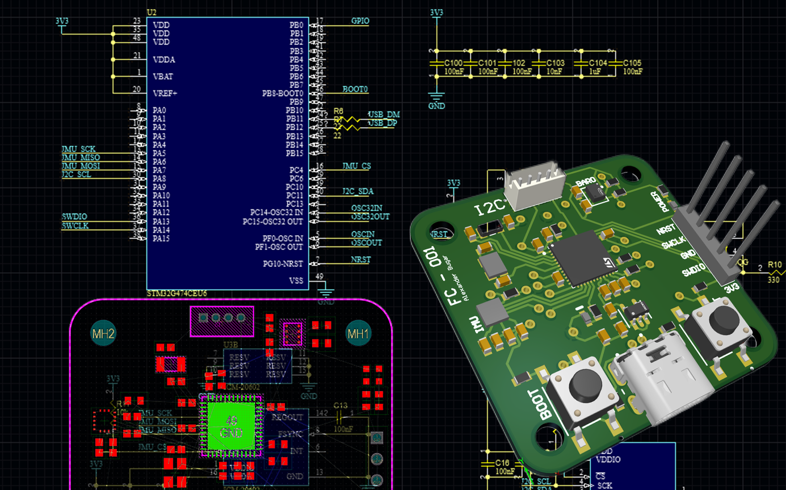
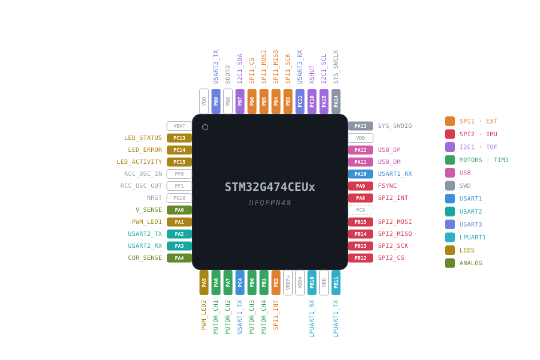

# Flight Controller

A quadcopter flight controller I'm building from scratch, firmware and hardware both. The whole point was to actually teach myself how real-time embedded systems like drones work, so I stayed away from using LLMs even for the trivial stuff. That forced me to sit down and understand the things I would've otherwise skipped: how an EKF actually works, how a cascaded PID loop comes together, how to get a sensor talking cleanly over SPI without hoping for the best.

> To see the full build log go to my site: [alexanderbugar.com](https://alexanderbugar.com)

## Where it's at

Right now it's in the bring-up and estimator phase, running on a **WeAct STM32G474** breadboard with an **ICM-20602**, since that's what I had on hand to prototype with. The custom PCB it's actually meant to run on is a separate project, and once that board arrives the firmware ports over to it.

The thing I was happiest about recently was getting a deterministic **1 ms IMU loop** running clean. It's fully DMA driven, so the CPU never sits there blocking on the SPI bus. I fire off a read, poll a sample-ready flag, consume the sample when the hardware's done, and immediately re-arm the next one so it's already on its way before I'm finished with the current sample.

The other one was finally having automated tests instead of flashing firmware and squinting at a serial terminal. I wired in Google Test and wrote a few checks for the estimator: that it starts at the identity quaternion, stays normalized, and doesn't spit out NaNs under simple conditions. Nothing fancy, but it beats testing everything on hardware.

**Working**

- STM32 project generated with CubeMX, FreeRTOS task scheduling
- USB CDC serial debug streaming
- C/C++ bridge so the flight-controller code sits apart from the generated files
- ICM-20602 SPI driver: `WHO_AM_I` validation, accel/gyro burst reads, DMA reads
- Deterministic 1 ms DMA-driven IMU loop
- Vector and quaternion math utilities
- EKF first revision + passing unit tests (Google Test)

**In progress**

- Sensor calibration
- Attitude estimation wired into the loop
- Cascaded PID control

## Hardware

| Component        | Role                        | Interface | Status                 |
| ---------------- | --------------------------- | --------- | ---------------------- |
| STM32H743VIT6    | Main MCU                    | -         | Current PCB target     |
| STM32G474RET6    | Previous 64-pin MCU package | -         | Legacy configuration   |
| STM32G474CEU6    | Previous 48-pin MCU package | -         | Legacy configuration   |
| ICM-20602        | 6-axis IMU                  | SPI       | Working (prototype)    |
| ICM-42688-P      | 6-axis IMU                  | SPI       | Planned (custom board) |
| BMP585           | Barometer                   | SPI       | Planned (custom board) |
| PY25Q128HA       | 16 MB flash for blackbox    | SPI       | Planned (custom board) |
| microSD          | Onboard logging             | SDMMC     | Planned (custom board) |
| VL53L1X          | Time-of-flight range sensor | I2C       | Planned                |
| PMW3901          | Optical-flow sensor         | SPI       | Planned                |
| Pi 5 or Jetson   | Higher-level autonomy       | UART      | Planned                |

I picked the STM32H7 for the Cortex-M7 with a double-precision FPU, which matters more than it sounds for an EKF carrying covariance matrices, and for having enough peripherals that I am not trading one interface against another. The IMU stays deliberately simple for now. While I'm debugging SPI, calibration, and estimation, fewer things that can go wrong is a good thing.

## The board

The firmware is meant to run on a custom flight controller PCB I'm designing in Altium instead of a generic board I'd have to bend the code around. It's an all-in-one design that regulates power from the battery on-board and drives the motors with an FOC ESC. I'm putting some of the schematic PDFs in `hardware/` as I go, and the routing once it's done.

### Moving to the STM32H7

I ended up switching the custom board from the **STM32G474RET6** to the 100-pin LQFP **STM32H743VIT6**. The G4 was a fine part, but I kept hitting the same wall: every time I wanted to add something, I had to take something else away first. This board is meant to be a single spin, one I design once and actually order rather than iterating three times over, so I would rather pay for the headroom now than find out after the boards arrive that I am one timer short.

What the H743 gives me:

- a real **SDMMC** peripheral, so onboard SD logging is proper hardware instead of a bit-banged workaround
- enough independent timers for **eight motor outputs plus six aux channels** without sharing anything
- five UARTs, two SPI buses, I2C and FDCAN all live at the same time
- a Cortex-M7 at 480 MHz with a double-precision FPU and caches, which leaves the EKF a lot of room to grow into
- 2 MB of flash and 1 MB of RAM, so logging buffers and whatever autonomy code comes later stop being a budgeting exercise

The CubeMX configuration, generated firmware, linker scripts, startup code, and pinout documentation now all target the STM32H743VI in LQFP100. Once the pinout is confirmed, it is back to routing and finalizing the design.

Part of me still feels like I'm finding reasons not to order the board, but at some point I have to commit instead of continuing to add things and getting stuck in analysis paralysis.

## Repository layout

| Folder           | What's in it                                                        |
| ---------------- | ------------------------------------------------------------------- |
| `firmware/`      | The STM32CubeIDE project: CubeMX config, drivers, estimator, USB    |
| `hardware/`      | Schematics, and PCB files as the board work lands here              |
| `documentation/` | The pinout diagram and other docs                                   |
| `tools/`         | Small helper scripts for the repo                                   |

The old STM32G4 firmware from before the restructure is preserved on the [`legacy/lynn-fc`](../../tree/legacy/lynn-fc) branch.
The previous STM32G474CEU6 board configuration is preserved on the [`legacy/g474ceu`](../../tree/legacy/g474ceu) branch.
The previous STM32G474RET6 board configuration is preserved on the [`legacy/g474ret`](../../tree/legacy/g474ret) branch.

## Pinout

The STM32H743VI LQFP100 diagram and table below are generated automatically from the CubeMX `.ioc`, so they can't drift out of sync with the actual configuration.

<!-- PINOUT:BEGIN (auto-generated by tools/pinout/generate_pinout.py, do not edit by hand) -->

| Pin | Signal | Function | Bus |
|-----|--------|----------|-----|
| PA0 | `S_TIM5_CH1` | M_1 | MOTORS · TIM5/TIM1 |
| PA1 | `S_TIM5_CH2` | M_2 | MOTORS · TIM5/TIM1 |
| PA2 | `S_TIM5_CH3` | M_3 | MOTORS · TIM5/TIM1 |
| PA3 | `S_TIM5_CH4` | M_4 | MOTORS · TIM5/TIM1 |
| PA4 | `GPXTI4` | BARO_INT | SPI1 · BARO/FLASH |
| PA5 | `SPI1_SCK` | SPI1_SCK | SPI1 · BARO/FLASH |
| PA6 | `SPI1_MISO` | SPI1_MISO | SPI1 · BARO/FLASH |
| PA7 | `SPI1_MOSI` | SPI1_MOSI | SPI1 · BARO/FLASH |
| PA8 | `GPIO_Input` | SDMMC1_DETECT | SDMMC1 · SD CARD |
| PA9 | `USB_OTG_FS_VBUS` | USB_OTG_FS_VBUS | USB OTG FS |
| PA11 | `USB_OTG_FS_DM` | USB_OTG_FS_DM | USB OTG FS |
| PA12 | `USB_OTG_FS_DP` | USB_OTG_FS_DP | USB OTG FS |
| PA13 | `DEBUG_JTMS-SWDIO` | SWDIO | SWD |
| PA14 | `DEBUG_JTCK-SWCLK` | SWCLK | SWD |
| PB0 | `S_TIM3_CH3` | AUX_L3 | AUX · TIM3/TIM4 |
| PB1 | `S_TIM3_CH4` | AUX_L4 | AUX · TIM3/TIM4 |
| PB2 | `GPIO_Output` | FLASH_CS | SPI1 · BARO/FLASH |
| PB3 | `DEBUG_JTDO-SWO` | SWO | SWD |
| PB4 | `S_TIM3_CH1` | AUX_S1 | AUX · TIM3/TIM4 |
| PB5 | `S_TIM3_CH2` | AUX_S2 | AUX · TIM3/TIM4 |
| PB6 | `USART1_TX` | USART1_TX | USART1 |
| PB7 | `USART1_RX` | USART1_RX | USART1 |
| PB8 | `I2C1_SCL` | I2C1_SCL | I2C1 |
| PB9 | `I2C1_SDA` | I2C1_SDA | I2C1 |
| PB10 | `USART3_TX` | USART3_TX | USART3 |
| PB11 | `USART3_RX` | USART3_RX | USART3 |
| PB12 | `GPIO_Output` | IMU_CS | SPI2 · IMU |
| PB13 | `SPI2_SCK` | IMU_SCK | SPI2 · IMU |
| PB14 | `SPI2_MISO` | IMU_MISO | SPI2 · IMU |
| PB15 | `SPI2_MOSI` | IMU_MOSI | SPI2 · IMU |
| PC0 | `ADCx_INP10` | ESC_C | ANALOG |
| PC4 | `ADCx_INP4` | ESC_V | ANALOG |
| PC5 | `GPIO_Output` | BARO_CS | SPI1 · BARO/FLASH |
| PC6 | `S_TIM8_CH1` | BUZZER | BUZZER · TIM8 |
| PC8 | `SDMMC1_D0` | SDMMC1_D0 | SDMMC1 · SD CARD |
| PC9 | `SDMMC1_D1` | SDMMC1_D1 | SDMMC1 · SD CARD |
| PC10 | `SDMMC1_D2` | SDMMC1_D2 | SDMMC1 · SD CARD |
| PC11 | `SDMMC1_D3` | SDMMC1_D3 | SDMMC1 · SD CARD |
| PC12 | `SDMMC1_CK` | SDMMC1_CK | SDMMC1 · SD CARD |
| PD0 | `FDCAN1_RX` | FDCAN1_RX | FDCAN1 |
| PD1 | `FDCAN1_TX` | FDCAN1_TX | FDCAN1 |
| PD2 | `SDMMC1_CMD` | SDMMC1_CMD | SDMMC1 · SD CARD |
| PD3 | `USART2_CTS` | COMPANION_CTS | USART2 · COMPANION |
| PD4 | `USART2_RTS` | COMPANION_RTS | USART2 · COMPANION |
| PD5 | `USART2_TX` | COMPANION_TX | USART2 · COMPANION |
| PD6 | `USART2_RX` | COMPANION_RX | USART2 · COMPANION |
| PD7 | `GPIO_Input` | SYNC | GPIO · EXPOSED |
| PD8 | `GPXTI8` | IMU_INT | SPI2 · IMU |
| PD9 | `GPIO_Output` | IMU_FSYNC | SPI2 · IMU |
| PD12 | `S_TIM4_CH1` | AUX_L1 | AUX · TIM3/TIM4 |
| PD13 | `S_TIM4_CH2` | AUX_L2 | AUX · TIM3/TIM4 |
| PE0 | `UART8_RX` | UART8_RX | UART8 |
| PE1 | `UART8_TX` | UART8_TX | UART8 |
| PE2 | `GPIO_Output` | LED_1 | LEDS |
| PE3 | `GPIO_Output` | LED_2 | LEDS |
| PE4 | `GPIO_Output` | LED_3 | LEDS |
| PE5 | `GPIO_Output` | EXPOSED_E5 | GPIO · EXPOSED |
| PE6 | `GPIO_Output` | EXPOSED_E6 | GPIO · EXPOSED |
| PE7 | `UART7_RX` | ESC_TELEM | UART7 · ESC TELEM |
| PE8 | `UART7_TX` | EXPOSED_UART7_TX | UART7 · ESC TELEM |
| PE9 | `S_TIM1_CH1` | M_5 | MOTORS · TIM5/TIM1 |
| PE11 | `S_TIM1_CH2` | M_6 | MOTORS · TIM5/TIM1 |
| PE13 | `S_TIM1_CH3` | M_7 | MOTORS · TIM5/TIM1 |
| PE14 | `S_TIM1_CH4` | M_8 | MOTORS · TIM5/TIM1 |
| PH0 | `RCC_OSC_IN` | RCC_OSC_IN | System |
| PH1 | `RCC_OSC_OUT` | RCC_OSC_OUT | System |
| NRST | `-` | NRST | System |
| BOOT0 | `-` | BOOT0 | System |

<!-- PINOUT:END -->

## References

The resources that helped me the most, in case they're useful to anyone else going down this path:

- Joan Solà, *Quaternion kinematics for the error-state Kalman filter*
- Tellex, Brown, Lupashin, *Estimation for Quadrotors*
- James Han, [*The Extended Kalman Filter (EKF): Why Taylor Expansions are Awesome*](https://www.youtube.com/watch?v=9X3jGGnbcvU) (YouTube)

## Links

- **Site / build log:** [alexanderbugar.com](https://alexanderbugar.com)
- **GitHub:** [cascade-interactive](https://github.com/cascade-interactive)
- **LinkedIn:** [Alexander Bugar](https://www.linkedin.com/in/alexander-bugar-0569a0226/)

## License

This is my portfolio work. Feel free to read through it, learn from it, and use it in your own non-commercial projects, just credit me. Please don't sell it or use it in anything commercial. Formally that's [CC BY-NC 4.0](https://creativecommons.org/licenses/by-nc/4.0/), see [LICENSE](LICENSE).
